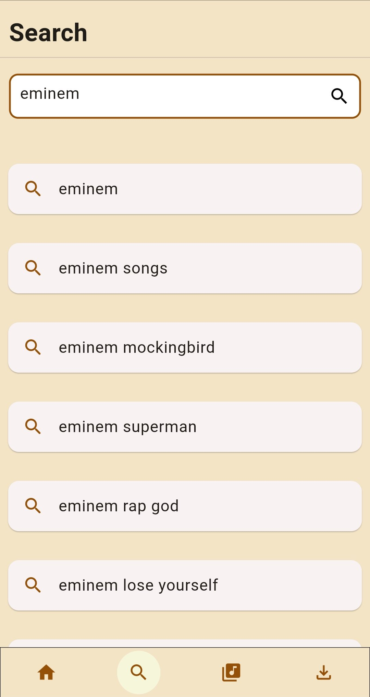
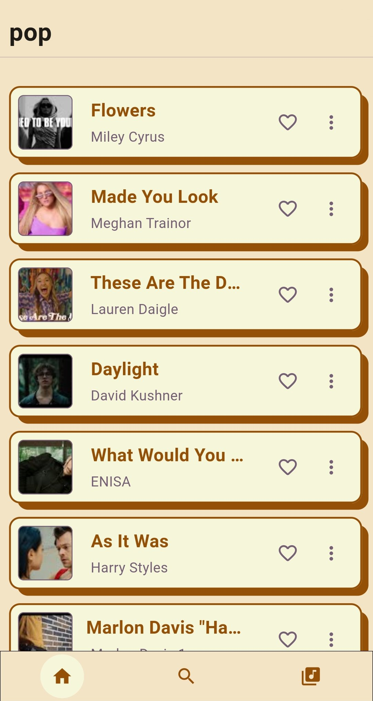

# Limusic.

Limusic a Flutter-based mobile application that provides users with the ability to stream ad-free music and download their favorite tracks for offline listening. This app offers a seamless and enjoyable music experience, allowing users to explore, discover, and enjoy their favorite tunes on the go.

## Features

* Ad-Free Streaming: Enjoy uninterrupted music streaming without any annoying ads.
* Offline Downloads: Download your preferred songs and albums for offline listening.
* Vast Music Library: Access an extensive collection of music from various genres.
* Curated Playlists: Discover carefully curated playlists for different moods.
* Intuitive User Interface: Navigate the app effortlessly with a user-friendly interface.

## Screenshots

  
  
  
  

## Getting Started

This project is a starting point for a Flutter application.

A few resources to get you started if this is your first Flutter project:

- [Lab: Write your first Flutter app](https://docs.flutter.dev/get-started/codelab)
- [Cookbook: Useful Flutter samples](https://docs.flutter.dev/cookbook)

For help getting started with Flutter development, view the
[online documentation](https://docs.flutter.dev/), which offers tutorials,
samples, guidance on mobile development, and a full API reference.
